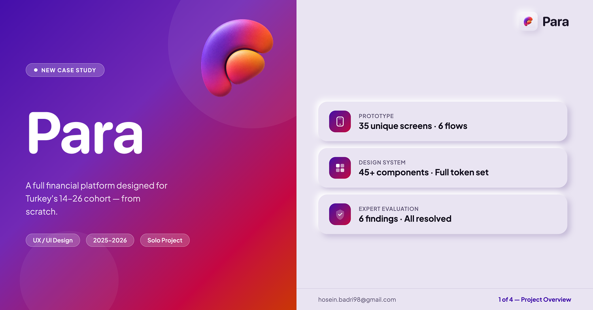
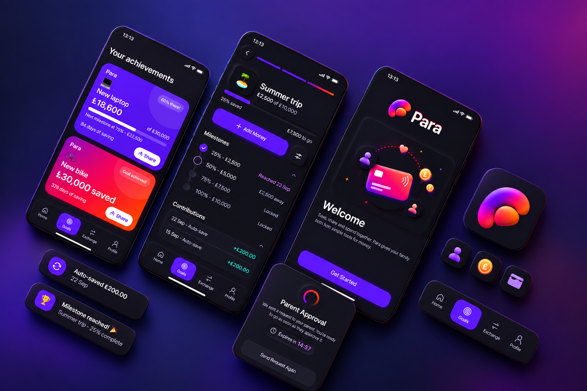
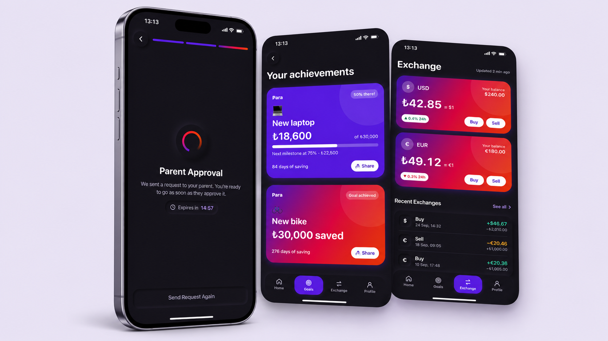

# Para — Youth Neobank for Turkey

> A full financial platform designed for Turkey's 14–26 cohort — from scratch.



[](https://seinhb.github.io/Para-Case-Study-/)
[](https://claude.ai/artifact/7URLMQ97zC2rRMX9wkFAyq)
[](https://claude.ai/artifact/YHH2fMowh7QSFCAkPng56s)

---

## Overview

Turkey has 85 million people. Nearly 40% are under 30. After Papara's youth offering was shut down in 2025, no product meaningfully served the 14–26 cohort — no savings tool built around TL inflation, no onboarding that works without a traditional bank account, no design that speaks to a generation that grew up on Spotify and Instagram.

**Para** is my attempt to fix that.

This is a solo UX/UI case study covering the full product design process: from competitive research and evidence-based personas through information architecture, a 35-screen interactive prototype, a complete design system, and a formal expert evaluation.

---

## Key Numbers

| Deliverable | Detail |
|---|---|
| 🖥️ Prototype | 35 unique screens · 6 user flows |
| 🧩 Design System | 45+ components · Full token set |
| 👥 Personas | 3 evidence-based profiles |
| 🔍 Expert Evaluation | 6 findings · All resolved |
| 📅 Timeline | 2025 – 2026 |
| 👤 Team | Solo designer |

---

## The 6 Flows

| ID | Flow | Description |
|---|---|---|
| A | Onboarding | Sign-up path with or without a Turkish bank account |
| B | Account | Dashboard, balance, transaction history |
| H | Goals | Savings goals with inflation-aware tracking |
| G | Exchange | Multi-currency exchange (TRY, USD, EUR) |
| X | Settings | Profile, notifications, security |
| P | Parental | Parent-linked account mode for under-18 users |

---

## Design Process

```
1. Competitive Audit      →  Benchmarked 8 apps across youth mode, multi-currency, Turkey coverage
2. Secondary Research     →  5 research clusters: financial literacy, Gen Z behavior, TL inflation, Turkish fintech regulation, UX patterns
3. Personas               →  3 profiles: Arda (17, student), Zeynep (22, freelancer), Ramin (24, international student)
4. Design Principles      →  6 principles grounding every product decision
5. Information Architecture →  Card sort → sitemap → task flow mapping
6. Wireframes             →  Low-fidelity flows for all 6 journeys
7. Design System          →  Neumorphic token system · 45+ components · Grape / Ember / Amber palette
8. Visual Design          →  35 high-fidelity screens across both light and dark mode
9. Expert Evaluation      →  Heuristic review · 6 usability findings · All resolved
```

---

## Design System

The Para design system is built on a neumorphic foundation — all surfaces share the same base token, with depth expressed through shadow pairs rather than color fills. This keeps the interface cohesive across light and dark mode without visual noise.

**Brand palette:**
- `Grape` `#5b21b6` — primary actions, navigation
- `Ember` `#d62452` — alerts, highlights
- `Amber` `#d94e0b` — warm accent
- Gradient: `120deg · Grape → Ember → Amber`

→ [Explore the full design system](https://claude.ai/artifact/YHH2fMowh7QSFCAkPng56s)

---

## Screenshots

| | |
|---|---|
|  |  |

---

## Tools & Methods

- **Design:** Figma
- **Research:** Competitive analysis, secondary research synthesis, persona development
- **Evaluation:** Expert heuristic evaluation (Nielsen's 10 heuristics)
- **Prototype:** Interactive Figma prototype (35 screens, 6 flows)
- **Case Study:** Self-contained HTML — no frameworks, no dependencies

---

## About the Designer

**Sein Badri** — UX/UI Designer

- 📧 hosein.badri98@gmail.com
- 💼 [LinkedIn](https://www.linkedin.com/in/sein-badri/)
- 🌐 [Case Study](https://seinhb.github.io/Para-Case-Study-/)

---

*This is case study 1 of 3. More coming soon.*
